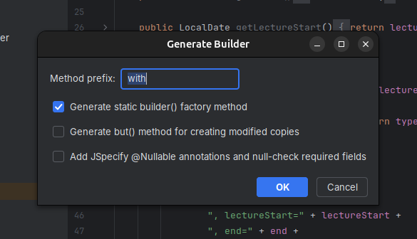

# Builder Builder

An IntelliJ IDEA plugin that generates builder classes for Java classes. It is a builder that builds builders :D

Select a Java class, open the Generate menu (Alt+Insert or Code > Generate), and pick "Builder" to add a nested `Builder` class for it. You choose which fields the builder should expose, and a couple of options for how it should look.

## Features

- Field chooser dialog to pick exactly which fields end up in the builder.
- If the class already has a constructor matching the selected fields, the builder calls it instead of assigning fields directly. This works with immutable classes and private constructors.
- Configurable setter method prefix, defaulting to `with` (for example `withName(...)`).
- Optional static `builder()` factory method.
- Optional `but()` method on the builder for creating modified copies.
- Optional JSpecify `@Nullable` annotations, with null checks for required fields thrown as `IllegalStateException` in `build()`.
- Fields already marked `@Deprecated` get a `@Deprecated` setter.
- Defaults for all of the above can be set under Settings/Preferences > Tools > Builder Builder, so you do not have to reconfigure them every time.



## Installing the plugin

There are two ways to get the plugin into IntelliJ IDEA.

1. From a release: download the plugin zip from the Releases page of this repository, then in IntelliJ IDEA go to Settings/Preferences > Plugins > the gear icon > Install Plugin from Disk, and select the downloaded zip.
2. From source: build it yourself following the steps below, then install the resulting zip the same way.

## Requirements

- JDK 21 (the project uses a Gradle toolchain, so any installed JDK 21 works).
- IntelliJ IDEA is downloaded automatically by the IntelliJ Platform Gradle Plugin, no manual setup needed.
- Optionally, the `task` CLI (Taskfile.dev) for the shortcuts described below. Everything also works with plain `./gradlew` commands.

## Building and developing

The repository ships a `Taskfile.yml` with the common commands:

```
task build     # compile and build the plugin
task test      # run the test suite
task run       # launch a sandboxed IDE with the plugin installed
task package   # build the distributable plugin zip (build/distributions)
task verify    # run the IntelliJ Plugin Verifier
task clean     # remove build outputs
```

Without `task`, the equivalent Gradle commands are `./gradlew build`, `./gradlew test`, `./gradlew runIde`, `./gradlew buildPlugin`, `./gradlew verifyPlugin`, and `./gradlew clean`.

To try out changes, run `task run` (or `./gradlew runIde`), which opens a separate sandboxed IntelliJ IDEA instance with the plugin already installed. Open or create a Java class there and use Generate > Builder to test the action.

## License

GPLv3, see the LICENSE file.
